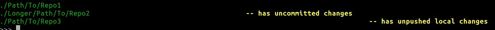

# GitList
_Displays the state of your local git repos_

If you've ever wanted a quick and easy overview of your git repos from the
command line - **GitList** - is for you.



## Installing

At present, clone this repo and then move _gitlist.py_ to a directory on your
PATH, and make it executable.

## Testing

Run the following commands:

```
    git clone --recurse-submodules git@github.com:craigiansmith/gitlist.git
    pipenv install --dev
    pipenv shell
    python -m pytest
```
